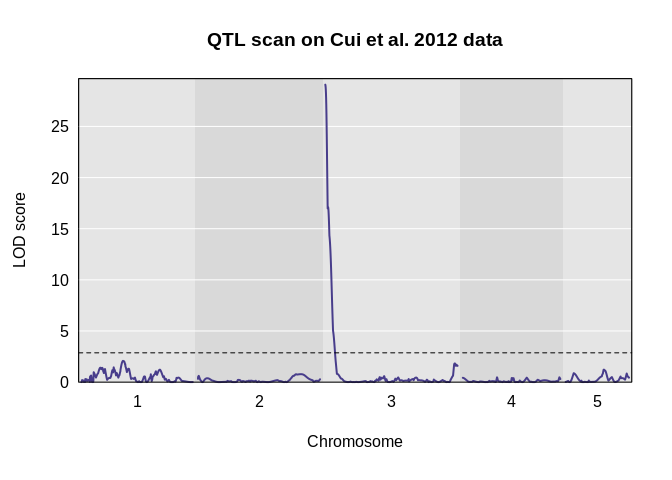
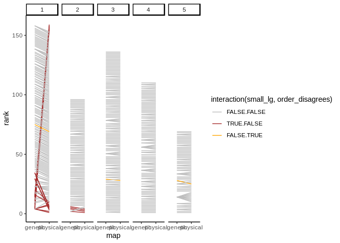
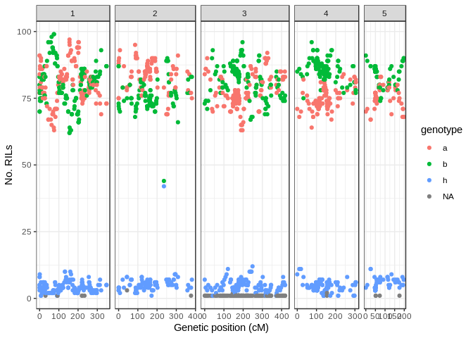
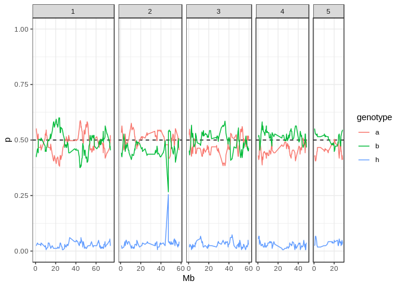

Summary
-------

There are three data files included in this repository.

-   `Cui2012_genotypes.rds` containing a `data.frame` object with all the genotypes provided in the original publication.
-   `Cui2012_qtl2cross.zip` that can be read with the `qtl2::read_cross2()` function.
-   `Cui2012_phenotype.rds` containing a `data.frame` object with phenotype data from the original publication (to use as example).

The data included in the *.zip* file (to create the `cross2` object with R/qtl2) were cleaned as follows:

-   Marker `Bsr1` was removed as it contains no physical position.
-   Marker `BD3399_2` was removed as it is redundant with marker `BD3399_1`.
-   Marker `BD0419_4` was removed as it has very high heterozygosity (and low frequency of "b" genotype)

Also note that:

-   There are several markers where the physical location disagrees with genetic location. These were kept as is, but care should be taken about this issue.
-   RIL001 is missing all genotypes for chromosome 3.

These issues are detailed in a section below.

Quick start
-----------

Here, we show how to do a quick scan using the data provided.

``` r
# load library
library(qtl2)
```

#### Prepare genotypes

Download the genotype data formated for `R/qtl2` as a zip file from [here](https://github.com/tavareshugo/qtl2data/raw/master/brachy_Cui2012/Cui2012_qtl2cross.zip).

``` r
# Read cross object
ril_cross <- read_cross2("Cui2012_qtl2cross.zip")
```

    ## Warning in check_cross2(output): Physical map out of order on chr 1, 2, 3,
    ## 4, 5

``` r
# inspect its contents
ril_cross
```

    ## Warning in check_cross2(object): Physical map out of order on chr 1, 2, 3,
    ## 4, 5

    ## Object of class cross2 (crosstype "riself")
    ## 
    ## Total individuals            165
    ## No. genotyped individuals    165
    ## No. phenotyped individuals     0
    ## No. with both geno & pheno     0
    ## No. covariates                 0
    ## No. phenotype covariates       0
    ## 
    ## No. chromosomes                5
    ## Total markers                568
    ## 
    ## No. markers by chr:
    ##   1   2   3   4   5 
    ## 159  95 136 109  69

First we impute genotypes and calculate genotype probabilities

``` r
# insert pseudo-markers for evenly spaced scan
map <- insert_pseudomarkers(ril_cross$gmap, step = 0.5)

# calculate genotype probabilities - assume 1% error rate
prob <- calc_genoprob(ril_cross, map, error_prob = 0.01, cores = 3)
```

#### Prepare phenotype

Download the example phenotype data from [here](https://github.com/tavareshugo/qtl2data/raw/master/brachy_Cui2012/Cui2012_phenotype.rds)

``` r
# Read example phenotype from Cui 2012
ril_pheno <- readRDS("Cui2012_phenotype.rds")

# Inspect its contents
str(ril_pheno)
```

    ## 'data.frame':    164 obs. of  2 variables:
    ##  $ id       : chr  "Bd21" "RIL009" "Bd3-1" "RIL010" ...
    ##  $ phenotype: chr  "Susceptible" "Susceptible" "Resistant" "Susceptible" ...

Convert phenotype `data.frame` to a named vector, ensuring that we have the matching phenotype and genotype individuals:

``` r
# Convert phenotype to numeric
ril_pheno$phenotype <- as.numeric(ril_pheno$phenotype == "Susceptible")

# Create named phenotype vector
pheno <- ril_pheno$phenotype
names(pheno) <- ril_pheno$id

# Get RILs in same order as cross object
pheno <- pheno[ind_ids(ril_cross)]

# Some RILs are not present, remove them
pheno <- pheno[!is.na(pheno)]
```

Alternatively (perhaps more safely?), you could add the data to the `cross2` object using the helper function provided [here](https://gist.github.com/tavareshugo/b10c3dca303c28b2d161e439a6ffcac6). This will ensure the matching between RILs:

``` r
# Source function
source("https://gist.githubusercontent.com/tavareshugo/b10c3dca303c28b2d161e439a6ffcac6/raw/09df841ed6652d578c20efc62243e8a8e9a972f6/add_pheno.R")

# Add phenotype to cross2 object
ril_cross <- add_pheno(ril_cross, ril_pheno, idcol = "id")

# After this can use ril_cross$pheno to access phenotype data
```

#### Run scan

Finally, we can run a simple scan. Note that because the trait is presence/absence we use the "binary" model:

``` r
# Run scan
pheno_scan <- scan1(prob, pheno, model = "binary")

# Run permutations - small number so it doesn't run for long
pheno_perm <- scan1perm(prob, pheno, model = "binary", n_perm = 100, cores = 3)

# Make a plot
plot_scan1(pheno_scan, map, main = "QTL scan on Cui et al. 2012 data")
abline(h = summary(pheno_perm), lty = 2)
```



Genotype issues
---------------

Some genotype issues are detailed here.

``` r
library(qtl2)
library(dplyr)
library(tidyr)
library(stringr)
library(ggplot2)
theme_set(theme_bw())
```

Download the genotype data as a `data.frame` from [here](https://github.com/tavareshugo/qtl2data/raw/master/brachy_Cui2012/Cui2012_genotypes.rds).

``` r
# Read SNP table
ril_snps <- readRDS("Cui2012_genotypes.rds")
```

#### RIL001 missing genotypes

RIL001 is missing all genotypes for chromosome 3. Other RILs miss at most 2 genotypes per chromosome.

``` r
ril_snps %>%
  group_by(chrom, id) %>%
  count(n_NA = sum(is.na(genotype))) %>%
  arrange(-n_NA) %>% 
  head()
```

    ## # A tibble: 6 x 4
    ## # Groups:   chrom, id [6]
    ##   chrom id      n_NA     n
    ##   <chr> <chr>  <int> <int>
    ## 1 3     RIL001   137   137
    ## 2 1     RIL035     2   159
    ## 3 5     RIL082     2    69
    ## 4 1     RIL056     1   159
    ## 5 1     RIL081     1   159
    ## 6 1     RIL104     1   159

#### Marker `Bsr1` has no physical position

This marker is the candidate gene from [Cui et al 2012]() work. This was excluded from the `cross2` object, since it lacks physical position.

``` r
ril_snps %>%
  filter(is.na(pos_bp) | is.na(pos_cm)) %>%
  count(marker)
```

    ## # A tibble: 1 x 2
    ##   marker     n
    ##   <chr>  <int>
    ## 1 Bsr1     165

#### Comments

There are several types of comments added to some of the markers.

``` r
ril_snps %>%
  count(comments)
```

    ## # A tibble: 6 x 2
    ##   comments                                                          n
    ##   <chr>                                                         <int>
    ## 1 <NA>                                                          87945
    ## 2 genetic order disagrees with physical location                  165
    ## 3 genetic order disagrees with physical location, not in F2 map   330
    ## 4 not in F2 map                                                  1320
    ## 5 not in the F2 map                                              1155
    ## 6 placed small linkage group here based on physical location     3300

These were converted to three logical columns:

-   `order_disagrees` - TRUE if commented as "genetic order disagrees with physical location"
-   `in_f2_map` - FALSE if commented as "not in F2 map"/"not in the F2 map"
-   `small_lg` - TRUE if commented as "placed small linkage group here based on physical location"

#### Genetic and physical order disagree

In the dataset of Cui 2012 some markers are commented as "genetic order disagrees with physical location". Others are commented as "placed small linkage group here based on physical location".

These create cases where the physical and genetic positions two are in disagreement. In fact, some of the ones highlighted by Cui 2012 do not seem to disagree.

This issue affects Chr1 in particular:

``` r
ril_snps %>% 
  filter(!is.na(pos_bp) & !is.na(pos_cm)) %>% 
  distinct(marker, chrom, pos_cm, pos_bp, order_disagrees, in_f2_map, small_lg) %>%
  group_by(chrom) %>%
  mutate(physical = rank(pos_bp),
         genetic = rank(pos_cm)) %>%
  ungroup() %>%
  select(marker, chrom, physical, genetic, order_disagrees, in_f2_map, small_lg) %>%
  gather("map", "rank", physical, genetic) %>%
  ggplot(aes(map, rank)) +
  geom_line(aes(group = marker, colour = interaction(small_lg, order_disagrees))) +
  facet_grid(~ chrom) +
  scale_colour_manual(values = c("grey", "brown", "orange")) +
  theme_classic()
```



These were kept in the `cross2` object as they are, although one should be aware of potential issues with QTL at the edges of Chr1.

#### Redundant marker

Two SNP markers occur in the same physical location:

``` r
ril_snps %>% 
  distinct(marker, chrom, pos_bp, pos_cm) %>% 
  group_by(chrom, pos_bp, pos_cm) %>% 
  filter(n() > 1)
```

    ## # A tibble: 2 x 4
    ## # Groups:   chrom, pos_bp, pos_cm [1]
    ##   marker   chrom   pos_bp pos_cm
    ##   <chr>    <chr>    <dbl>  <dbl>
    ## 1 BD3399_2 4     15826374   130.
    ## 2 BD3399_1 4     15826374   130.

The genotypes at these two markers are therefore completely redundant:

``` r
ril_snps %>% 
  filter(marker %in% c("BD3399_2", "BD3399_1")) %>% 
  spread(marker, genotype) %>% 
  # check if any cases where genotypes disagree
  filter(BD3399_1 != BD3399_2)
```

    ## # A tibble: 0 x 10
    ## # … with 10 variables: chrom <chr>, pos_cm <dbl>, pos_bp <dbl>,
    ## #   comments <chr>, id <chr>, order_disagrees <lgl>, in_f2_map <lgl>,
    ## #   small_lg <lgl>, BD3399_1 <chr>, BD3399_2 <chr>

One of these markers was therefore removed from the `cross2` object.

#### heterozygosity

Most individuals are homozygous at the markers, but some markers have heterozygous individuals

``` r
ril_snps %>%
  count(chrom, pos_cm, marker, genotype) %>%
  ggplot(aes(pos_cm, n, colour = genotype)) +
  geom_point() +
  facet_grid(~ chrom, scales = "free", space = "free") +
  labs(x = "Genetic position (cM)", y = "No. RILs")
```



Here is a similar graph, but showing it as a frequency:

``` r
# Look at frequency of genotypes across genome
ril_snps %>%
  # remove missing genotypes
  filter(!is.na(pos_bp) & !is.na(genotype)) %>%
  # count genotypes per marker
  count(marker, genotype, pos_bp, chrom) %>%
  # calculate proportion of each genotype per marker
  group_by(marker) %>%
  mutate(p = n/sum(n)) %>%
  # make plot
  ggplot(aes(pos_bp/1e6, p, colour = genotype)) +
  geom_hline(yintercept = 0.5, linetype = 2) +
  geom_line() +
  facet_grid( ~ chrom, scales = "free_x", space = "free_x") +
  scale_x_continuous(breaks = seq(0, 80, 20)) +
  coord_cartesian(ylim = c(0, 1)) +
  labs(x = "Mb")
```



There is one marker with very distorted frequency of "b" genotype in favour of "h". This marker (*BD0419\_4*) was removed from the `cross2` object:

``` r
ril_snps %>%
  filter(genotype == "h") %>% 
  count(marker) %>% 
  arrange(-n) %>% 
  head()
```

    ## # A tibble: 6 x 2
    ##   marker       n
    ##   <chr>    <int>
    ## 1 BD0419_4    42
    ## 2 BD0277_1    12
    ## 3 BD0289_1    11
    ## 4 BD1271_1    11
    ## 5 BD2019_1    11
    ## 6 BD2635_1    11
